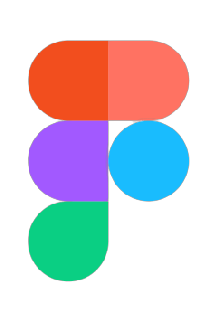
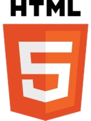
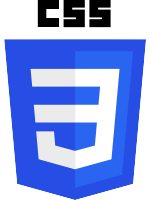
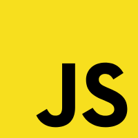
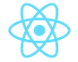
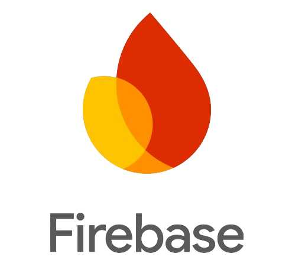
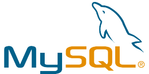

# Bienvenue👋

  
<b>Qui suis-je ?</b>

 
Je m'appelle Eva, j'ai 19 ans, passionnée par l'informatique, le développement, le design et les jeux vidéo. J'aime créer des mondes numériques, travailler sur mes projets tout en collaborant avec d'autres. Je suis déterminée à innover et à progresser dans ce domaine en constante évolution, prête à relever de nouveaux défis pour apprendre, explorer et créer.

### Langages et outils :  

  
  
  
  
  
  
  
  

<!--
**eva-dpr2004/eva-dpr2004** is a ✨ _special_ ✨ repository because its `README.md` (this file) appears on your GitHub profile.

Here are some ideas to get you started:
- 🔭 I’m currently working on ...
- 🌱 I’m currently learning ...
- 👯 I’m looking to collaborate on ...
- 🤔 I’m looking for help with ...
- 💬 Ask me about ...
- 📫 How to reach me: ...
- 😄 Pronouns: ...
- ⚡ Fun fact: ...
-->
