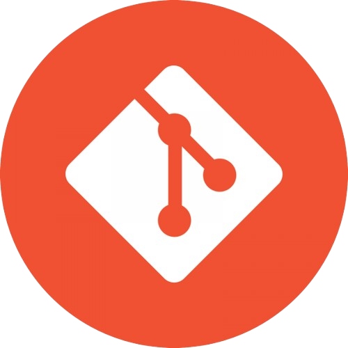

# Bienvenue👋

  
<b>Qui suis-je ?</b>

 
Je m'appelle Eva, jeune passionnée de 19 ans axée sur l'informatique, le développement, le design et les jeux vidéo. Mon parcours se construit autour de la création de mondes numériques, alliant autonomie dans mes projets personnels et collaboration pour apprendre des autres. Ma démarche équilibrée reflète ma volonté d'innover. Je m'engage à progresser constamment dans cet univers en constante évolution, prête à relever les défis pour apprendre, explorer et créer.

### Langages et outils :  

  
  
  
  
  
  
  

<!--
**eva-dpr2004/eva-dpr2004** is a ✨ _special_ ✨ repository because its `README.md` (this file) appears on your GitHub profile.

Here are some ideas to get you started:
- 🔭 I’m currently working on ...
- 🌱 I’m currently learning ...
- 👯 I’m looking to collaborate on ...
- 🤔 I’m looking for help with ...
- 💬 Ask me about ...
- 📫 How to reach me: ...
- 😄 Pronouns: ...
- ⚡ Fun fact: ...
-->
