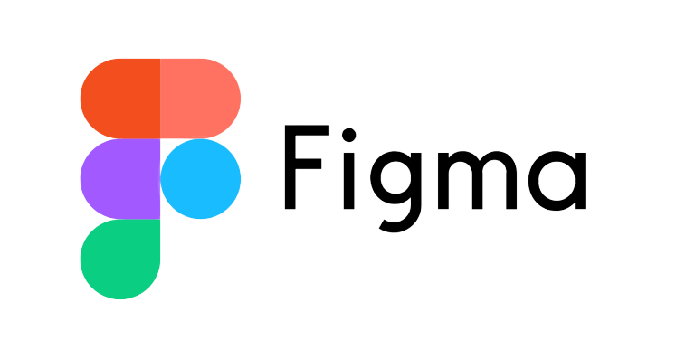

# Bienvenue👋
### Je m'appelle Eva, j'ai 19ans et je suis passionnée par le développement ! 

Voici une petite énigme si tu souhaite me connaitre ! 

 
const nom = "enigme des passions"; 
const passionA = "oc"; 
const passionA2 = "de"; 
const passionB1 = "j"; 
const passionB2 = "ue"; 
const passionB3 = "x"; 
const passionB4 = "odiév".split("").reverse().join(""); 

const phraseStructurée = "Je suis structuré et universel, je suis le "; 
const phraseImmersive = "Je suis immersif, interactif et créatif, je suis le "; 

const enigmeComplète =
phraseStructurée +
passionA +
passionA2 +
" et " +
phraseImmersive +
passionB1 +
passionB2.split("").reverse().join("") +
passionB3 +
passionB4 +
".";

 
  Alors, tu as su trouver le résultat?:thinking:

 

### Mes compétences 

  

<!--
**eva-dpr2004/eva-dpr2004** is a ✨ _special_ ✨ repository because its `README.md` (this file) appears on your GitHub profile.

Here are some ideas to get you started:

- 🔭 I’m currently working on ...
- 🌱 I’m currently learning ...
- 👯 I’m looking to collaborate on ...
- 🤔 I’m looking for help with ...
- 💬 Ask me about ...
- 📫 How to reach me: ...
- 😄 Pronouns: ...
- ⚡ Fun fact: ...
-->
